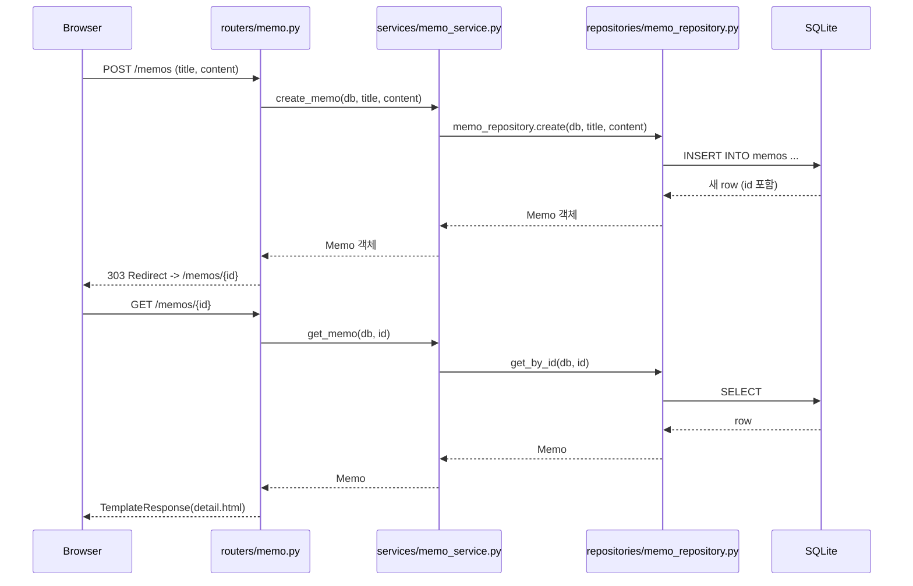

# b5-2 구술 평가 대비 문서

과제 목표 5개 문장을 하나씩 내 코드로 답한다. "설명할 수 있다"는 결국 "코드를 가리키면서 말할 수 있다"는 뜻이라, 파일 경로와 줄 단위로 근거를 남겼다.

---

## 1. 요청이 라우터 → 서비스 → 저장소 → 템플릿으로 흐르는 과정

`POST /memos` (메모 등록)를 예로 들면:



역할 경계는 명확하다.

- **라우터** (`routers/memo.py`): HTTP 요청/응답만 안다. `Form(...)`으로 값 받고, 서비스 호출하고, `RedirectResponse`나 `TemplateResponse`로 감싼다. SQL을 직접 짜지 않는다.
- **서비스** (`services/memo_service.py`): "존재하지 않으면 `MemoNotFoundError`", "저장 전 공백 정리(`title.strip()`)" 같은 판단이 여기 있다. HTTP를 모른다 — `Request`나 상태 코드가 이 파일에 등장하지 않는다.
- **저장소** (`repositories/memo_repository.py`): `db.query(Memo)...` 같은 SQLAlchemy 호출만 있다. "존재하지 않으면 에러"같은 판단은 없고 그냥 `None`을 반환한다. 판단은 서비스 몫이다.
- **템플릿** (`templates/*.html`): 최종적으로 사람이 보는 HTML. 라우터가 넘긴 컨텍스트(`{"memo": memo}`)만 그린다.

계층을 나눈 이유는 단순하다: `services/memo_service.py`는 라우터를 몰라도 단위 테스트 가능하고, 저장소를 SQLite에서 Postgres로 바꿔도 서비스/라우터는 안 건드린다.

---

## 2. GET과 POST를 분리하는 이유

`routers/memo.py`를 보면 같은 URL 패턴(`/memos/{memo_id}/edit`)에 GET과 POST가 둘 다 있다.

```python
@router.get("/{memo_id}/edit")   # 폼을 "보여주기"만 함 — 데이터 변경 없음
def edit_memo_form(...): ...

@router.post("/{memo_id}/edit")  # 실제로 DB를 "변경"함
def update_memo(...): ...
```

GET은 "조회"만 해야 한다 — 브라우저가 프리페치하거나, 링크를 클릭 몇 번 반복해도 서버 상태가 변하면 안 된다. POST는 "상태를 바꾸는 요청"이라는 약속이다. 만약 수정 화면 진입까지 POST로 처리했다면, 사용자가 `/memos/3/edit`을 새로고침만 해도 매번 서버에 "쓰기 시도"가 발생하는 것처럼 헷갈리는 구조가 된다. GET은 멱등(idempotent)해야 한다는 HTTP 스펙을 그대로 지킨 것뿐이다.

---

## 3. 폼 입력값이 Form 파라미터로 전달되는 과정

`routers/memo.py`의 `create_memo`:

```python
@router.post("")
def create_memo(
    request: Request,
    title: str = Form(...),
    content: str = Form(...),
    db: Session = Depends(get_db),
):
```

브라우저가 `templates/form.html`의 `<form method="post" action="/memos">`를 제출하면, `Content-Type: application/x-www-form-urlencoded`로 `title=...&content=...`가 body에 실려온다. FastAPI는 `Form(...)`이 붙은 파라미터를 보고 body를 파싱해서 함수 인자로 꽂아준다. `python-multipart`가 requirements.txt에 있는 이유가 이거다 — FastAPI가 폼 파싱을 위임하는 라이브러리다. `...`(Ellipsis)는 "필수값"이라는 뜻이라 title/content 없이 요청하면 FastAPI가 422를 자동으로 반환한다. 이 프로젝트는 별도 Pydantic Schema 클래스를 두지 않고 `Form()` 파라미터를 바로 서비스에 넘기는 방식을 택했다 — 단일 모델짜리 앱에서 DTO 클래스까지 만들면 계층이 하나 더 늘어나기만 하고 얻는 게 없었다.

---

## 4. PRG(Post-Redirect-Get) 패턴을 적용하는 이유

`routers/memo.py`의 모든 POST 핸들러는 `TemplateResponse`가 아니라 `RedirectResponse(url=..., status_code=303)`로 끝난다.

```python
memo = memo_service.create_memo(db, title, content)
return RedirectResponse(url=f"/memos/{memo.id}", status_code=303)
```

만약 POST 응답으로 바로 상세 화면을 렌더링했다면, 브라우저 주소창에는 여전히 `POST /memos`가 남는다. 사용자가 F5를 누르면 브라우저가 "이 요청을 다시 보낼까요?"라고 묻거나(누르면 재전송), 재전송하면 메모가 중복 생성된다. 303으로 리다이렉트하면 브라우저 주소창이 `GET /memos/{id}`로 바뀌고, 새로고침해도 그냥 GET만 다시 실행되어 안전하다. `test_app.py`의 self-check도 이걸 검증한다 — POST 이후 응답 상태가 303인지, 그리고 최종적으로 GET으로 도착한 화면에 내용이 반영됐는지 확인한다.

302가 아니라 303을 쓴 이유: 302는 스펙상 원래 메서드를 유지해도 되는 애매한 코드라 일부 클라이언트가 리다이렉트할 때도 POST를 반복할 수 있다. 303은 "무조건 GET으로 가라"는 명확한 지시다.

---

## 5. SQLAlchemy ORM으로 CRUD가 동작하는 원리 (내 코드 기준)

`models/memo.py`:

```python
class Memo(Base):
    __tablename__ = "memos"
    id = Column(Integer, primary_key=True, index=True)
    title = Column(String(200), nullable=False)
    content = Column(Text, nullable=False)
    created_at = Column(DateTime, default=lambda: datetime.now(timezone.utc))
```

`Base`는 `database.py`의 `declarative_base()`다. `main.py`가 시작할 때 `Base.metadata.create_all(bind=engine)`을 호출하는데, 이게 `Memo` 클래스 정의를 읽고 실제 SQLite에 `CREATE TABLE memos (...)`를 실행한다. 클래스 = 테이블, 인스턴스 = row, 속성 = 컬럼이라는 매핑이다.

CRUD 각각이 `repositories/memo_repository.py`에서 어떻게 SQL이 되는지:

| 함수 | ORM 호출 | 실제 의미 |
|---|---|---|
| `get_all` | `db.query(Memo).order_by(Memo.created_at.desc()).all()` | `SELECT * FROM memos ORDER BY created_at DESC` |
| `get_by_id` | `db.query(Memo).filter(Memo.id == memo_id).first()` | `SELECT * FROM memos WHERE id = ? LIMIT 1` |
| `create` | `db.add(memo)` 후 `db.commit()` | `INSERT INTO memos (...)` |
| `update` | 속성 재할당 후 `db.commit()` | `UPDATE memos SET ... WHERE id = ?` (SQLAlchemy가 변경 감지로 자동 생성) |
| `delete` | `db.delete(memo)` 후 `db.commit()` | `DELETE FROM memos WHERE id = ?` |

`update`가 특히 재미있는 지점이다 — 명시적으로 `UPDATE` 문을 쓴 적이 없다. `db.query(...).first()`로 가져온 객체는 Session이 "추적 중"인 상태라, 속성을 바꾸고 `commit()`만 호출하면 SQLAlchemy가 변경된 필드를 스스로 감지해서 UPDATE를 만든다. 이게 ORM이 "Object-Relational **Mapping**"인 이유다 — 파이썬 객체 상태 변화가 곧 DB 상태 변화로 매핑된다.

Session은 `database.py`의 `get_db()`가 요청마다 새로 만들고(`SessionLocal()`), 요청이 끝나면 `finally`에서 닫는다. `routers/*.py`가 `Depends(get_db)`로 이걸 주입받는 이유는, 요청마다 독립된 Session을 보장하기 위해서다 — 여러 요청이 같은 Session을 공유하면 커밋 시점이 꼬인다.

---

## 스킵한 것 (자문자답)

**왜 Pydantic Schema를 안 만들었나?** requirements.md는 "권장 사항"이라고만 했다. 모델이 Memo 하나, 필드 3개짜리 앱에서 `MemoCreate`/`MemoResponse` 스키마 클래스까지 만들면 `Form()` 파라미터 → 스키마 → ORM 모델, 3단 변환이 생긴다. 지금 구조( `Form()` → 서비스 함수 인자 → ORM 모델)로도 라우터가 ORM 모델을 직접 반환하지 않는다는 원칙(권장 사항의 핵심)은 지켜진다 — 애초에 라우터는 JSON이 아니라 `TemplateResponse`만 반환한다.

**왜 서버사이드 필수값 검증을 안 넣었나?** requirements.md 5번(보너스)에 있는 항목이라 뺐다. `templates/form.html`의 `required` 속성으로 브라우저 단에서만 막는다. curl로 빈 값을 보내면 뚫린다 — 필요해지면 `services/memo_service.py`의 `create_memo`에 `if not title.strip(): raise ValueError(...)` 한 줄이면 된다.
